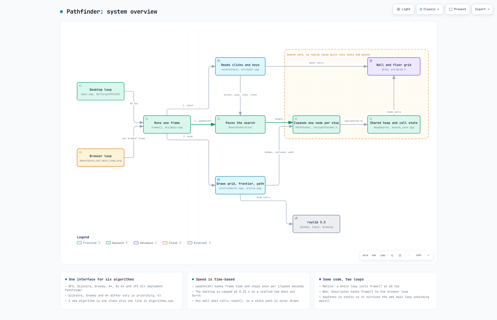
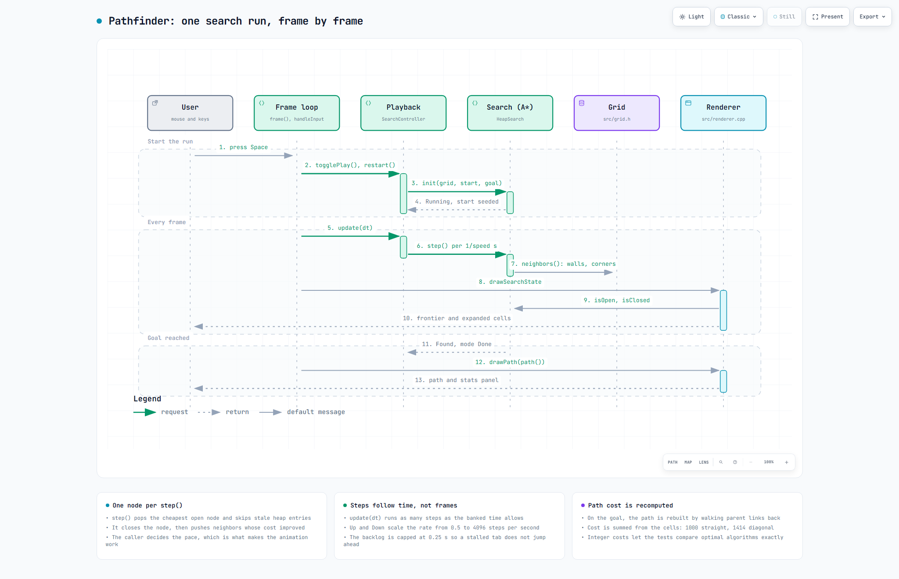
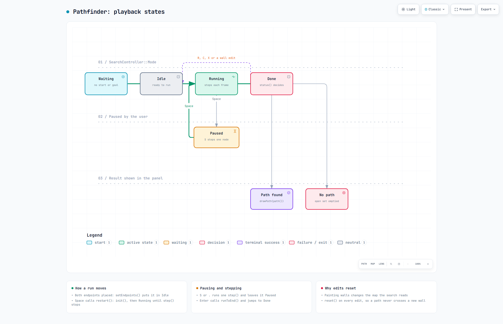
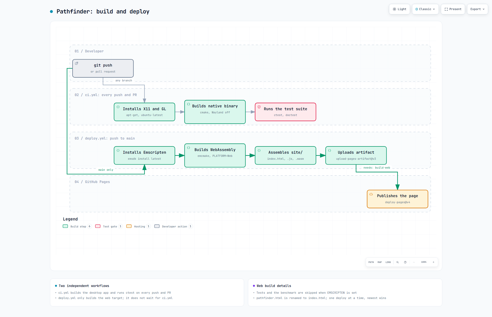

# Pathfinder

[](https://github.com/samad-zeeshan/pathfinder/actions/workflows/ci.yml)
[](https://github.com/samad-zeeshan/pathfinder/actions/workflows/deploy.yml)

An interactive pathfinding visualizer written in C++17 and raylib. It compiles to
WebAssembly, so it runs in the browser with nothing to install.


Paint walls on a grid, drop a start and a goal, then watch the search spread out one
node at a time.

## Architecture

Every algorithm implements the same interface, [`Pathfinder`](src/pathfinder.h): `init`,
`step` (expand exactly one node), `isOpen`/`isClosed`, `path`, and `stats`. The renderer,
the playback loop, and the tests all use that interface and never touch a specific
algorithm. To add an algorithm you write one new class and add a single line to the
registry in [`algorithms.cpp`](src/algorithms.cpp). Nothing else has to change.

The shared machinery lives in [`search_core`](src/search_core.h): movement rules,
per-cell state, path reconstruction, and the best-first heap. That is why each algorithm
stays small. Here is Dijkstra in full:

```cpp
class DijkstraSearch : public HeapSearch {
public:
    const char* name() const override { return "Dijkstra"; }
protected:
    int priority(int g, int /*h*/) const override { return g; }
};
```

Presentation is split the same way. [`theme.h`](src/theme.h) holds the design tokens,
[`ui`](src/ui.h) holds the reusable components (cards, badges, stat rows, keycaps), and
[`renderer`](src/renderer.h) handles the grid drawing. The panel in `main.cpp` just puts
those pieces together. The UI font (JetBrains Mono, OFL) is baked into the binary, so the
native app, the web build, and the standalone exe all render the same.

## How it works

Each frame reads input, advances the chosen search by as many single-node steps as the elapsed time allows, and draws the grid from what the search reports.


The frame loop, the playback controller, the search core behind the `Pathfinder` interface, and the two loops (desktop and browser) that drive it.


One run from pressing Space to the drawn path, with one `step()` expansion per tick of the controller.


The `SearchController` modes and the keys that move between them.


`ci.yml` builds and tests the native app; `deploy.yml` builds the WebAssembly target and publishes it to GitHub Pages.

Interactive versions with pan, zoom and theme switch: `docs/diagrams/overview.html`, `docs/diagrams/main-flow.html`, `docs/diagrams/states.html`, `docs/diagrams/deployment.html`


## The algorithms

Listed in the order the number keys step through them, which is also the order the demo
walks you through:

| Key | Algorithm | Orders by | Optimal? | What it shows |
|---|---|---|---|---|
| 1 | BFS | hop count | only when every move costs the same | fewest hops is not the same as shortest distance on a diagonal grid |
| 2 | Dijkstra | g (cost so far) | yes | always optimal, but it explores in every direction |
| 3 | Greedy Best-First | h (heuristic only) | no | fast but often wrong, watch it hug walls |
| 4 | A* | g + h | yes | Dijkstra's guarantee for a fraction of the work |
| 5 | Bidirectional A* | g + h from both ends | yes | searches from both ends and meets in the middle, where getting the stop condition right is the tricky part |
| 6 | Jump Point Search | g + h over jump points | yes | uses grid symmetry to skip almost everything |

Two details in the source are worth a look. Bi-A* keeps going after the two frontiers
first meet, because the first meeting is not always the cheapest one
([bidirectional.cpp](src/bidirectional.cpp)). And JPS re-derives its pruning rules for the
no-corner-cutting movement rule, which changes where forced neighbors show up
([jps.cpp](src/jps.cpp)).

Costs are integers: 1000 for a straight move and 1414 for a diagonal. Using integers lets
the optimal algorithms be compared for exactly equal cost. Diagonal moves never cut across
the corner of a wall.

## Benchmark

`pathfinder_bench` runs every registered algorithm over nine committed map fixtures (open,
maze, and rooms, each in small, medium, and large) and prints the table below. The numbers
are from an MSVC Release build, taking the median of 7 runs. This is the large rooms map:

| Map | Algorithm | Nodes expanded | Path cost | Time (us) |
|---|---|---:|---:|---:|
| rooms-l | BFS | 2103 | 80 | 102 |
| rooms-l | Dijkstra | 2132 | 91178 | 221 |
| rooms-l | Greedy | 196 | 99764 | 16 |
| rooms-l | A* | 795 | 91178 | 81 |
| rooms-l | Bi-A* | 1638 | 91178 | 256 |
| rooms-l | JPS | 96 | 91178 | 31 |

Reading one set of rows: A* expands 63% fewer nodes than Dijkstra and reaches the same
optimal cost, and JPS cuts another 88% off A*. Greedy expands the fewest nodes of anything
except JPS, but it pays for that with a path about 9% more expensive here, and 22% more on
the large maze. BFS reports its cost as a hop count because it ignores move costs
entirely, which is why that number is in a different unit. There is an honest negative
result in here too. Bi-A* beats Dijkstra but loses to plain A* on these maps. With a strong
heuristic on a 2D grid, the two half-searches overlap more than they save.

<details>
<summary>Full results (all nine maps)</summary>

| Map | Algorithm | Nodes expanded | Path cost | Time (us) |
|---|---|---:|---:|---:|
| open-s | BFS | 258 | 20 | 21 |
| open-s | Dijkstra | 268 | 24968 | 31 |
| open-s | Greedy | 22 | 24968 | 2 |
| open-s | A* | 24 | 24968 | 2 |
| open-s | Bi-A* | 114 | 24968 | 11 |
| open-s | JPS | 22 | 24968 | 4 |
| open-m | BFS | 1068 | 43 | 65 |
| open-m | Dijkstra | 1074 | 52522 | 80 |
| open-m | Greedy | 48 | 54522 | 6 |
| open-m | A* | 247 | 52522 | 39 |
| open-m | Bi-A* | 559 | 52522 | 115 |
| open-m | JPS | 106 | 52522 | 35 |
| open-l | BFS | 4252 | 85 | 265 |
| open-l | Dijkstra | 4252 | 106114 | 466 |
| open-l | Greedy | 95 | 110700 | 15 |
| open-l | A* | 1066 | 106114 | 214 |
| open-l | Bi-A* | 1972 | 106114 | 373 |
| open-l | JPS | 434 | 106114 | 123 |
| maze-s | BFS | 88 | 31 | 5 |
| maze-s | Dijkstra | 90 | 31414 | 7 |
| maze-s | Greedy | 33 | 32000 | 3 |
| maze-s | A* | 56 | 31414 | 5 |
| maze-s | Bi-A* | 129 | 31414 | 12 |
| maze-s | JPS | 23 | 31414 | 4 |
| maze-m | BFS | 640 | 99 | 38 |
| maze-m | Dijkstra | 641 | 100242 | 57 |
| maze-m | Greedy | 197 | 149414 | 23 |
| maze-m | A* | 554 | 100242 | 37 |
| maze-m | Bi-A* | 1031 | 100242 | 121 |
| maze-m | JPS | 194 | 100242 | 20 |
| maze-l | BFS | 2575 | 155 | 146 |
| maze-l | Dijkstra | 2575 | 157070 | 275 |
| maze-l | Greedy | 254 | 192000 | 16 |
| maze-l | A* | 1615 | 157070 | 163 |
| maze-l | Bi-A* | 3446 | 157070 | 438 |
| maze-l | JPS | 571 | 157070 | 70 |
| rooms-s | BFS | 77 | 16 | 3 |
| rooms-s | Dijkstra | 78 | 17656 | 4 |
| rooms-s | Greedy | 22 | 18484 | 2 |
| rooms-s | A* | 40 | 17656 | 3 |
| rooms-s | Bi-A* | 56 | 17656 | 5 |
| rooms-s | JPS | 9 | 17656 | 1 |
| rooms-m | BFS | 271 | 52 | 14 |
| rooms-m | Dijkstra | 273 | 54484 | 15 |
| rooms-m | Greedy | 119 | 78726 | 8 |
| rooms-m | A* | 110 | 54484 | 7 |
| rooms-m | Bi-A* | 210 | 54484 | 15 |
| rooms-m | JPS | 13 | 54484 | 4 |
| rooms-l | BFS | 2103 | 80 | 102 |
| rooms-l | Dijkstra | 2132 | 91178 | 221 |
| rooms-l | Greedy | 196 | 99764 | 16 |
| rooms-l | A* | 795 | 91178 | 81 |
| rooms-l | Bi-A* | 1638 | 91178 | 256 |
| rooms-l | JPS | 96 | 91178 | 31 |

</details>

Regenerate with:

```sh
cmake --build build --target pathfinder_bench
./build/pathfinder_bench maps
```

## Verification

Correctness comes from a deterministic oracle, not from the animation looking right.
Across hundreds of randomly generated maps, the suite checks that:

- Every optimal algorithm (Dijkstra, A*, Bi-A*, JPS) agrees on the exact path cost. If
  they disagree, one of them has a bug. This is what catches a wrong Bi-A* stop condition
  or a bad JPS pruning rule.
- BFS matches Dijkstra when every move costs one, on the same maps with a unit cost model.
- Greedy never beats the optimal cost, though it may match it.
- If any algorithm finds no path, all of them find no path, because reachability is a
  property of the graph and not of the algorithm.

Every algorithm in the registry also passes a set of per-path checks (correct endpoints, a
contiguous path, no corner cutting, only walkable cells) and produces byte-identical
results on repeat runs. A new algorithm gets all of these tests for free once it is
registered.

```sh
cmake --build build --target pathfinder_tests
./build/pathfinder_tests
```

## Controls

| Input | Action |
|---|---|
| Left-drag | Paint or erase walls |
| Right-click | Place start |
| Shift + Right-click | Place goal |
| 1 to 6 | Select algorithm (restarts an active run so you can compare) |
| Space | Play or pause |
| S or . | Single step |
| Enter | Run to end |
| R or C | Clear the search |
| X | Clear all walls |
| Up or Down | Speed (continuous and frame-rate independent) |

The side panel shows live search stats: nodes expanded, frontier size, path length, and
path cost. That is what turns the animation into a comparison tool. Run two algorithms on
the same map and read the numbers side by side.

## Building locally

Native (needs CMake 3.20 or newer and a C++17 compiler; raylib is downloaded for you):

```sh
cmake -S . -B build -DCMAKE_BUILD_TYPE=Release
cmake --build build --config Release
```

The grid defaults to 40 by 30 cells at 18 px each. The native binary takes `--cols`,
`--rows`, and `--cell-size` to change that (`./build/pathfinder --cols 60 --rows 40 --cell-size 14`).

Web (needs an activated [emsdk](https://emscripten.org/docs/getting_started/downloads.html)):

```sh
emcmake cmake -S . -B build-web -DPLATFORM=Web -DCMAKE_BUILD_TYPE=Release
cmake --build build-web
```

The web build produces `build-web/pathfinder.html` along with its `.js` and `.wasm` files.
The deploy workflow publishes them to GitHub Pages on every push to `main`.

## Future work

Two more algorithms would fit the same interface without changing anything else:

- Weighted A* (ε·h). A one-line change from A* that trades some optimality for speed and
  gives the benchmark a tunable data point.
- Theta*. Any-angle paths found with line-of-sight checks. It is the one addition that
  breaks the grid-contiguity check, so it would need a looser path test: neighboring
  waypoints have to see each other rather than sit next to each other on the grid.
</content>
</invoke>
